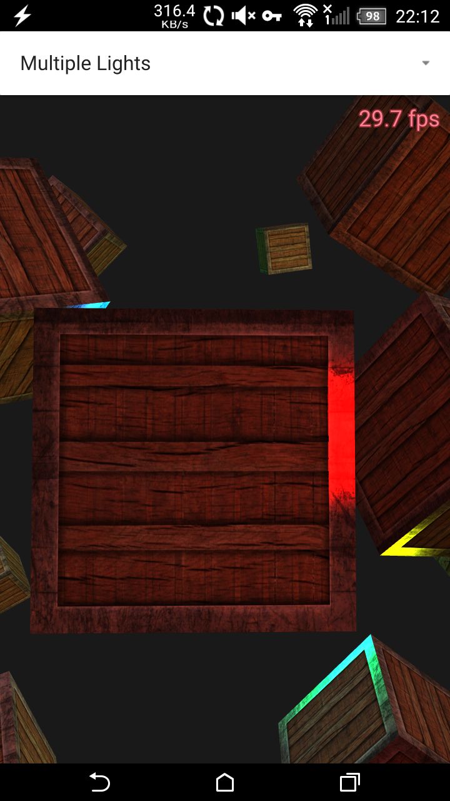

# learnopengl-qt3d

Qt3D version of http://learnopengl.com/ examples, currently works with Qt5.7.
I created this repo aiming to understand how Qt3D works.

Pure QML version, use qmlscene to run with default OpenGL Context:

Compiled version, context set to GL4.3/GLES3.0:

Notes
===

Main qml file for qmlscene/binary/QmlCreator

* app.qml: main window with line chart FPS display

* app-cpp.qml: main window with text FPS display

* main.qml: QuickItem as root + text FPS display

You can lauch one sample with a keyword like:

* qmlscene skybox app.qml
* ./learnopengl-qt3d geometry

**Some large assets from the website is downloaded by qmake script(*nix only), connection is required at the first build or after updated. Use CONFIG += no_assets to skip. See assets.pri for details**

**leanopengl uses a little different lighting model from Qt3D default model, to rendering models for a better result, please slightly modify the ka, kd in mtl files**

Examples
===

1. [Hello Window](doc/Hello-Window.md) : works
1. [Hello Triangle](doc/Hello-Triangle.md) : works
1. [Shaders](doc/Shaders.md) : works
1. [Texture](doc/Texture.md) : works
1. [Transformations](doc/Transformations.md) : works
1. [Coordinate Systems](doc/Coordinate-Systems.md) : works
