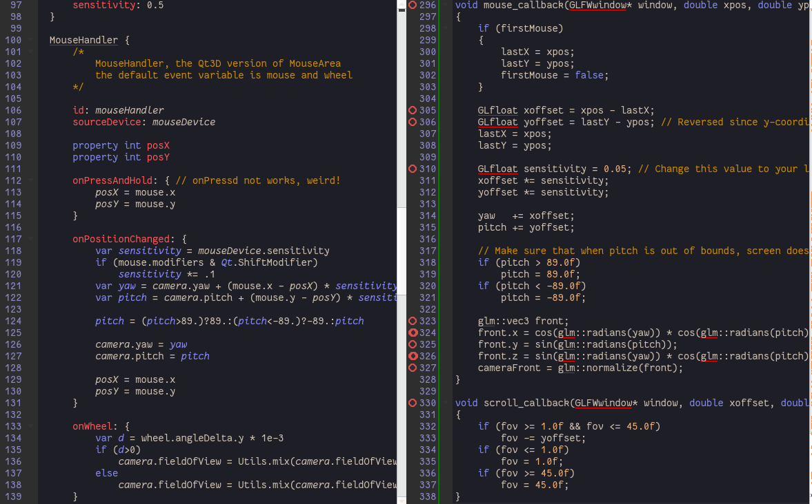

Camera
======

This section is full of things about mathematics. We just need a QML type to handle camera calculations, there it is, the Camera QML type. But we can DIY fully because it is just math, aha?

Qt has covered what glm could provided for us:

> vector, matrix, quaternion...

Read the examples and documents to unleash your power.

> Tips:
>
> -	Hey, quaternion in QML sucks!
> -	The Qt3D internal Camera type will be introduced in the next article.

[camera_circle](../qml/camera_circle.qml)
-----------------------------------------

[camera_keyboard](../qml/camera_keyboard.qml)
---------------------------------------------

Remember FrameSwap? It's true type is FrameAction, the event between frames. We should always adjust geometries and handle physics here.

> Tips:
>
> -	The Qt3D Logic based camera controller helps you handling camera moving, check out in [OurCameraController.qml](../qml/Components/OurCameraController.qml).

[camera\_keyboard\_dt](../qml/camera_keyboard_dt.qml)
-----------------------------------------------------

FrameAction support dt internally, we just calculate FPS by this argument.

[camera_zoom](../qml/camera_zoom.qml)
-------------------------------------

Use MouseHandler the way you do to MouseArea, modifiers can be passed into mouse event, try to press Shift for accurate aiming. Need zoom for touchscreen? You may need an outer PinchArea.

[camera_quaternion](../qml/camera_quaternion.qml)
-------------------------------------------------

Oh I can not invoke QQuaternion methods to do calculations now...

[camera-exercise1](../qml/camera-exercise1.qml)
-----------------------------------------------

You may enjoy the world you can not fly but infinite jump!

[camera-exercise2](../qml/camera-exercise2.qml)
-----------------------------------------------
