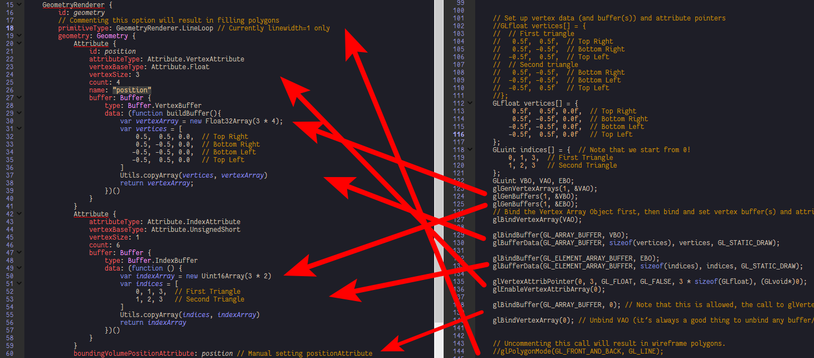

# Hello Triangle

Any Qt3D renderable Entity is assembled with three parts:

> vertices, transforms, shaders

in qml code:

```qml
Entity {

	GeometryRenderer {
		id: geometry
	}
	
	Transform {
		id: transform
	}
	
	Material {
		id: material
	}
    
	components: [geometry, transform, material]
}
```

There is no z-order or render order for unassembled entities, thus any following style works:

```qml
GeometryRenderer {
	id: geometry
}

Transform {
	id: transform
}

Material {
	id: material
}
    
Entity {
	components: [geometry, transform, material]
}
```

```qml

Transform {
	id: transform
}

Material {
	id: material
}

Entity {
	
	GeometryRenderer {
		id: geometry
	}
    
	components: [geometry, transform, material]
}
```

Flow
---
```
GeometryRenderer <- Geometry <- Attribute <- Buffer <- vertices
      |                             |          |           |
      V                             ------------------------
Transform  ------------------------------------>    |
      |                                             |
      V                                             V
Material -> Effect -> Technique -> RenderPass -> ShaderProgram
```

hellotriangle
===

1. Use ShaderProgram to link shader program flow:

	

2. Use Attribute to bind VBO

	
	
3. Entity.components assmbles vertices and shader programs, RenderPass set the render flow (using default settings)

	

hellotriangle2
===

1. Corresponding...:

	
