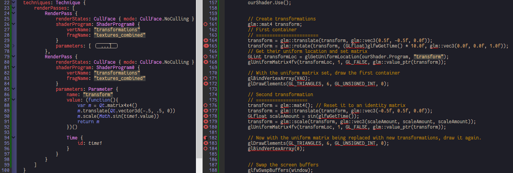

# Transformations

In Qt we have types for math calculation such as vector3d, matrix4x4, to generate transformations we can do calculation
based on them, for details please see Qt's documentaion about
basic QML types.

```qml
var m = Qt.matrix4x4()
m.translate(Qt.vector3d(1, -1, 0).times(.5))
m = m.times(rotateAround(joint, angle, Qt.vector3d(0,0,1)))
```

[transformations](../qml/transformations.qml)
===

1. Give a mat4 uniform a binding of our time value:


[transformations-exercise1](../qml/transformations-exercise1.qml)
===

[transformations-exercise2](../qml/transformations-exercise2.qml)
===
The original program makes 2 glDraw call with the same shader, in Qt3D we should change the uniform in another render pass where only transform is changed. By the way, parameters can be set in several rendering classes, this time we put them into RenderPass:


